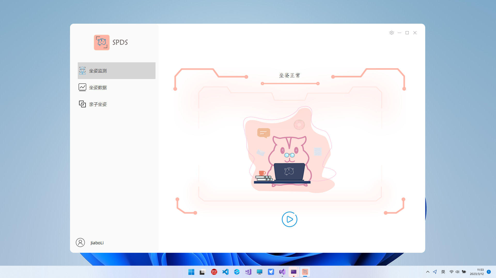

# SPDS_Server
**坐姿检测系统服务端**

## 项目介绍

​         本项目能够检测用户坐姿并给予反馈，项目包含客户端和服务端，实现了登陆、注册、坐姿检测、数据可视化、关联账户数据浏览等功能。  

客户端：https://github.com/JiaboLi-GitHub/SPDS-Client

## 项目开放所用技术

- C++

- [Qt](https://www.qt.io/zh-cn/)

- [MySQL](https://www.mysql.com/)

- [SMTP Client for Qt (C++)](https://github.com/bluetiger9/SmtpClient-for-Qt)

  

## 实现功能

1. 使用Qt提供的QTcpServer类和QTcpSocket类进行套接字通讯。
2. 使用Qt提供的QThread类实现多线程，为多个客户端提供服务。
3. 通过ODBC连接MySQL数据库，执行增删改查操作。
4. 使用SMTP组件发送验证码邮件。

## 展示：

